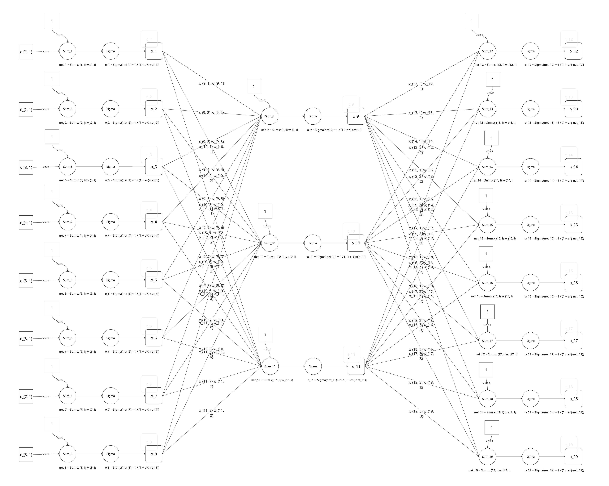
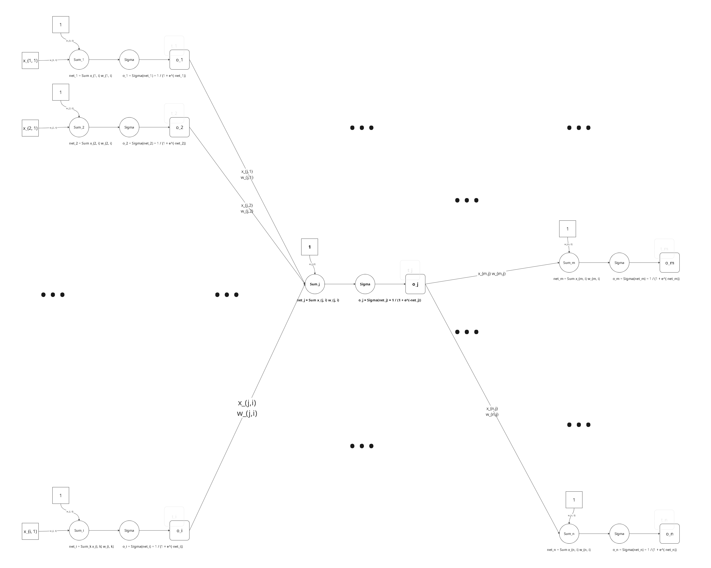
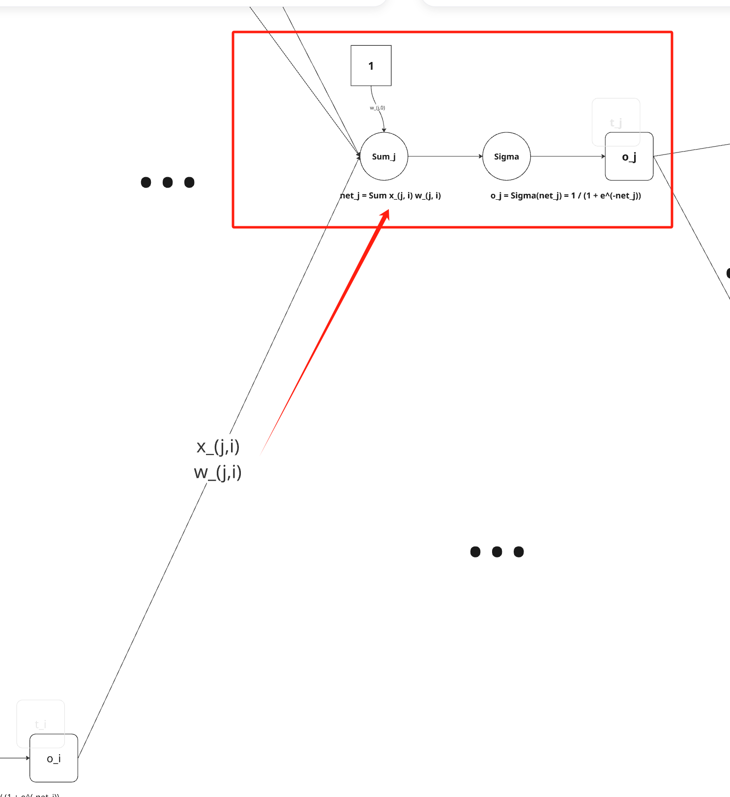
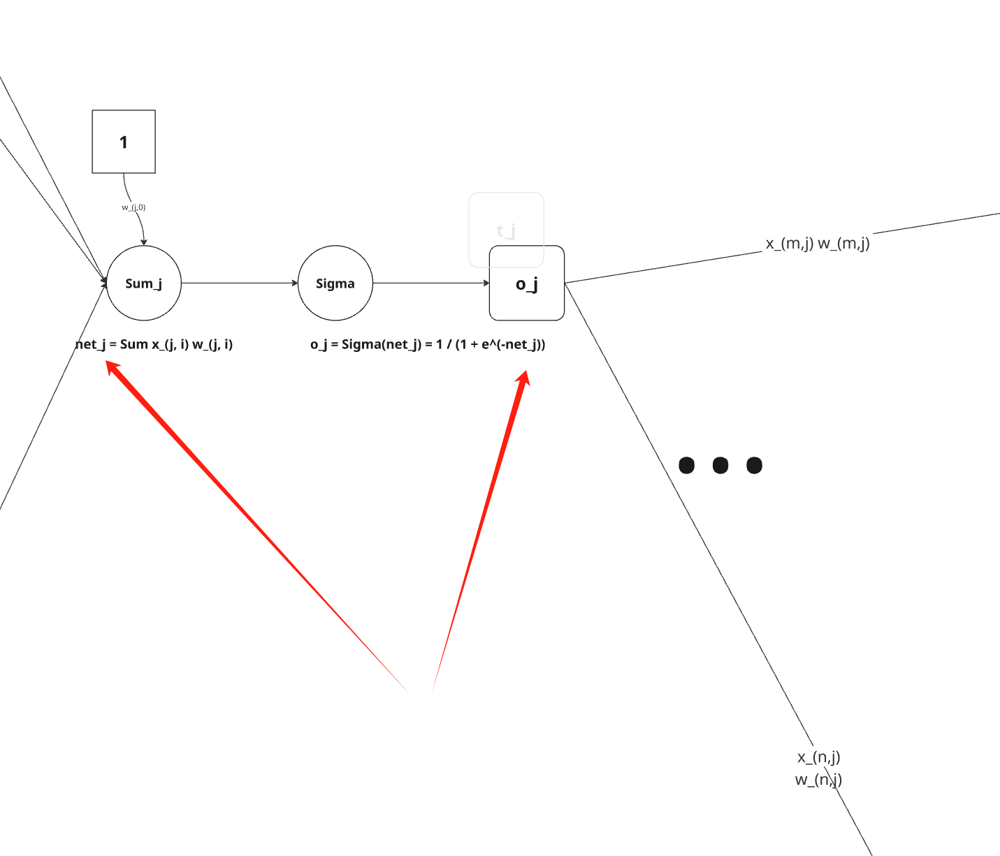
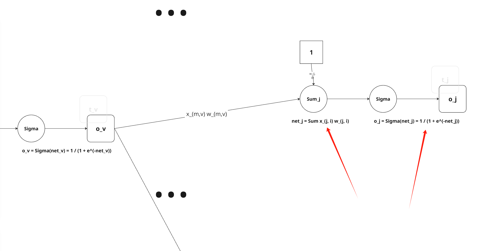
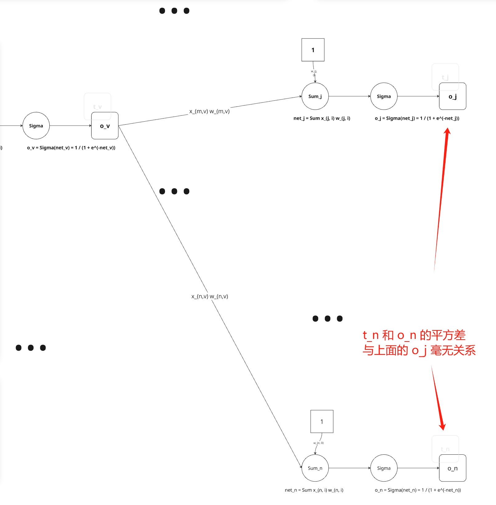

# 4.10

考虑第4.8.1节中描述的另一种误差函数：

$$
E(\overrightarrow{w}) \equiv \frac{1}{2} \sum_{d \in D} \sum_{k \in outputs} (t_{kd} - o_{kd})^2 + \gamma \sum_{i, j} w_{ji}^2
$$

为这个误差函数E推导出梯度下降更新法则。证明这个权值更新法则的实现可通过在进行表4-2的标准梯度下降权更新前把每个权值乘以一个常数。

---

先看一下表4-2的标准梯度下降权重更新法则：

表4-2 包含两层 sigmoid 单元的前馈网络的反向传播算法（随机梯度下降版本）

---
$$
BACKPROPOGATION(training\_examples, \eta, n_{in}, n_{out}, n_{hidden}) \\
    traning\_examples 中每一个训练样例是形式为<\overrightarrow x, \overrightarrow t>的序偶，其中 \overrightarrow x 是网络输入值向量，\overrightarrow t 是目标输出值。\\
    \eta 是学习速率（例如0.05）。n_{in}是网络输入的数量，n_{hidden} 是隐藏层单元数，n_{out} 是输出单元数。\\
    从单元i到单元j的输入表示为x_{ji}，单元i到单元j的权值表示为w_{ji}。\\
    \cdot 创建具有n_{in}个输入，n_{hidden}个隐藏单元，n_{out}个输出单元的网络\\
    \cdot 初始化所有的网络权值为小的随机值（例如-0.05和0.05之间的数）
    \cdot 在遇到终止条件前：\\
        \cdot 对于训练样例 traning\_examples 中的每个<\overrightarrow x, \overrightarrow t>： \\
            把输入沿网络前向传播 \\
                1. 把实例\overrightarrow x输入网络，并计算网络中每个单元u的输出o_u\\
            使误差沿网络反向传播 \\
                2. 对于网络的每个输出单元k，计算它的误差项\delta_k \\
                \delta_k \leftarrow o_k(1-o_k)(t_k - o_k) \\
                3. 对于网络的每个隐藏单元h，计算它的误差项\delta_h \\
                \delta_h \leftarrow o_h(1-o_h)\sum_{k \in outputs} w_{kh}\delta_k \\
                4. 更新每个网络权值 w_{ji} \\
                w_{ji} \leftarrow w_{ji} + \Delta w_{ji} \\
                其中 \\
                \Delta w_{ji} = \eta \delta_j x_{ji}
$$

---

对于一个8x3x8的网络，详细图形如下：

先来引入几个记号，以便于后面的推导。

令 $E_d(\overrightarrow{w})$ 表示在训练样例 $d$ 上的误差函数：$E_d(\overrightarrow{w}) \equiv \frac{1}{2} \sum_{k \in outputs} (t_{kd} - o_{kd})^2$。那么，在4.8.1节中描述的误差函数E可以写成：
$$
E(\overrightarrow{w}) \equiv \sum_{d \in D} E_d(\overrightarrow{w}) + \gamma \sum_{i, j} w_{ji}^2
$$

随机的梯度下降算法迭代处理训练样例，每次处理一个。对于每个训练样例d，本题要求利用整体误差 $E$ 的梯度来修改权值。换句话说，对于每一个训练样例d，每个权 $w_{ji}$ 被增加 $\Delta w_{ji}$：

$$
\Delta w_{ji} = - \eta \frac{\partial E}{\partial w_{ji}}
$$

我们的目标是求出$\frac{\partial E}{\partial w_{ji}}$的一个表达式，以便实现随机梯度下降法则。可以看出，

$$
\frac{\partial E}{\partial w_{ji}} = \sum_{d \in D} \frac{\partial E_d}{\partial w_{ji}} + 2\gamma w_{ji}
$$

我们剩下的任务就是为$\frac{\partial E_d}{\partial w_{ji}}$推导出一个方便的表达式。首先，注意权值 $w_{ji}$ 仅能通过 $net_j$ 影响网络的其他部分。

对于一个网络，其表示如下：

关注其中第 j 个单元，如下：

所以，我们可以使用链式法则得到：

$$
\frac{\partial E_d}{\partial w_{ji}} = \frac{\partial E_d}{\partial net_j} \frac{\partial net_j}{\partial w_{ji}} \\
= \frac{\partial E_d}{\partial net_j} x_{ji}
$$

于是剩下的任务就是为 $\frac{\partial E_d}{\partial net_j}$ 导出一个方便的表达式。我们依次考虑两种情况：一种情况是单元j是网络中的一个输出单元，另一种情况是单元j是网络中的一个内部单元。

## 情况1：输出单元的权值训练法则 

就像 $w_{ji}$ 仅能通过 $net_j$ 影响网络一样，$net_j$仅能通过$o_j$影响网络。

所以我们可以再次使用链式规则得出：

$$
\frac{\partial E_d}{\partial net_j} = \frac{\partial E_d}{\partial o_j} \frac{\partial o_j}{\partial net_j}
$$

首先，仅考虑上式中的第一项：

$$
\frac{\partial E_d}{\partial o_j} = \frac{\partial}{\partial o_j}(\frac{1}{2}\sum_{k \in outputs} (t_k - o_k)^2)
$$

除了当 k = j 时，所有输出单元 k 的导数 $\frac{\partial}{\partial o_j}(t_k - o_k)^2$ 为0。所以我们不必对多个输出单元求和，只需设 k = j。

$$
\frac{\partial E_d}{\partial o_j} = \frac{\partial}{\partial o_j}\frac{1}{2}(t_j - o_j)^2 \\
= \frac{1}{2} 2 (t_j - o_j) \frac{\partial (t_j - o_j)}{\partial o_j} \\
= -(t_j - o_j)
$$

接下来考虑第二项。既然$o_j=\sigma(net_j)$，导数$\frac{\partial o_j}{\partial net_j}$ 就是 sigmoid 函数的导数，即 $\sigma(net_j)(1-\sigma(net_j))$。所以：

$$
\frac{\partial o_j}{\partial net_j} = \frac{\partial \sigma(net_j)}{\partial net_j} \\
= o_j (1 - o_j)
$$

结合以上得到：

$$
\frac{\partial E_d}{\partial net_j} = -(t_j - o_j)o_j(1-o_j)
$$

结合以上，我们就得到了输出单元的随机梯度下降法则：

$$
\Delta w_{ji} = - \eta \frac{\partial E}{\partial w_{ji}} \\
= - \eta (\sum_{d \in D} \frac{\partial E_d}{\partial w_{ji}} + 2\gamma w_{ji}) \\
= - \eta (\sum_{d \in D} (t_j - o_j) o_j (1 - o_j) x_{ji} + 2 \gamma w_{ji}) \\
= - \sum_{d \in D} \eta (t_j - o_j) o_j (1 - o_j) x_{ji} - 2 \eta \gamma w_{ji}
$$

再回看表4-2中的权值更新法则：

$$
w_{ji} \leftarrow w_{ji} + \Delta w_{ji} \\
                其中 \\
                \Delta w_{ji} = \eta \delta_j x_{ji}
$$

而这里，输出单元的权值更新法则就对应的是：

$$
w_{ji} \leftarrow w_{ji} - \sum_{d \in D} \eta (t_j - o_j) o_j (1 - o_j) x_{ji} - 2 \eta \gamma w_{ji}
$$

如果令 $\delta_j = - \sum_{d \in D} (t_j - o_j) o_j (1 - o_j) $，那么输出单元的权值更新法则就是：

$$
w_{ji} \leftarrow (1 - 2 \eta \gamma)w_{ji} + \eta \delta_j x_{ji}
$$

所以，新的权值更新法则，就是在标准梯度下降权值更新以前，把每个权值乘以常数 $(1-2\eta\gamma)$。

