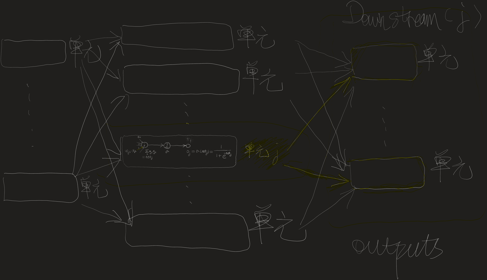

# 4.10

考虑第4.8.1节中描述的另一种误差函数：

$$
E(\overrightarrow{w}) \equiv \frac{1}{2} \sum_{d \in D} \sum_{k \in outputs} (t_{kd} - o_{kd})^2 + \gamma \sum_{i, j} w_{ji}^2
$$

为这个误差函数E推导出梯度下降更新法则。证明这个权值更新法则的实现可通过在进行表4-2的标准梯度下降权更新前把每个权值乘以一个常数。

---

先来引入几个记号，以便于后面的推导。

令 $E_d(\overrightarrow{w})$ 表示在训练样例 $d$ 上的误差函数：$E_d(\overrightarrow{w}) \equiv \frac{1}{2} \sum_{k \in outputs} (t_{kd} - o_{kd})^2$。那么，在4.8.1节中描述的误差函数E可以写成：
$$
E(\overrightarrow{w}) \equiv \sum_{d \in D} E_d(\overrightarrow{w}) + \gamma \sum_{i, j} w_{ji}^2
$$

我们的目标是求出$\frac{\partial E}{\partial w_{ji}}$的一个表达式，以便实现随机梯度下降法则。可以看出，

$$
\frac{\partial E}{\partial w_{ji}} = \sum_{d \in D} \frac{\partial E_d}{\partial w_{ji}} + 2\gamma w_{ji}$$
$$

先看一下表4-2的标准梯度下降权重更新法则：

表4-2 包含两层 sigmoid 单元的前馈网络的反向传播算法（随机梯度下降版本）

---
$$
BACKPROPOGATION(training\_examples, \eta, n_{in}, n_{out}, n_{hidden}) \\
    traning\_examples 中每一个训练样例是形式为<\overrightarrow x, \overrightarrow t>的序偶，其中 \overrightarrow x 是网络输入值向量，\overrightarrow t 是目标输出值。\\
    \eta 是学习速率（例如0.05）。n_{in}是网络输入的数量，n_{hidden} 是隐藏层单元数，n_{out} 是输出单元数。\\
    从单元i到单元j的输入表示为x_{ji}，单元i到单元j的权值表示为w_{ji}。\\
    \cdot 创建具有n_{in}个输入，n_{hidden}个隐藏单元，n_{out}个输出单元的网络\\
    \cdot 初始化所有的网络权值为小的随机值（例如-0.05和0.05之间的数）
    \cdot 在遇到终止条件前：\\
        \cdot 对于训练样例 traning\_examples 中的每个<\overrightarrow x, \overrightarrow t>： \\
            把输入沿网络前向传播 \\
                1. 把实例\overrightarrow x输入网络，并计算网络中每个单元u的输出o_u\\
            使误差沿网络反向传播 \\
                2. 对于网络的每个输出单元k，计算它的误差项\delta_k \\
                \delta_k \leftarrow o_k(1-o_k)(t_k - o_k) \\
                3. 对于网络的每个隐藏单元h，计算它的误差项\delta_h \\
                \delta_h \leftarrow o_h(1-o_h)\sum_{k \in outputs} w_{kh}\delta_k 
                4. 更新每个网络权值 w_{ji} \\
                w_{ji} \leftarrow w_{ji} + \Delta w_{ji} \\
                其中 \\
                \Delta w_{ji} = \eta \delta_j x_{ji}
$$
---