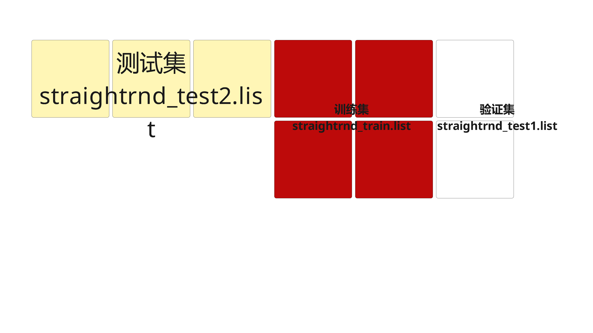
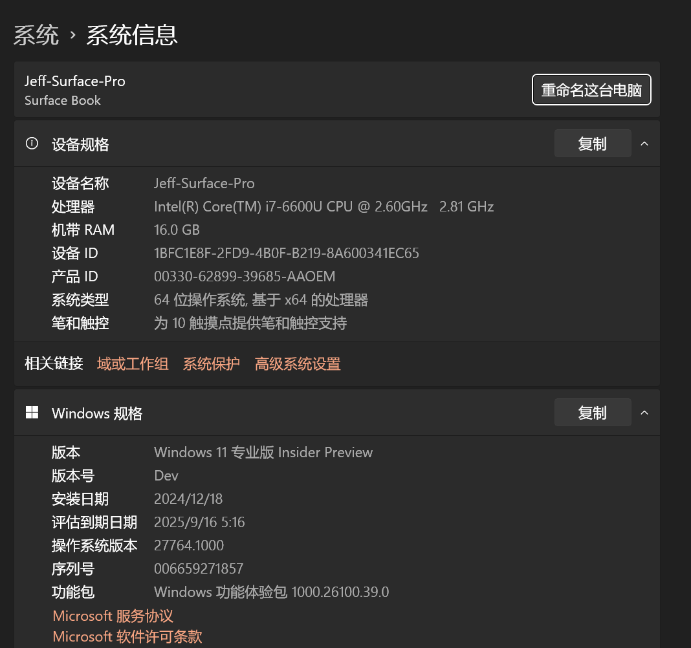

# 4.11

应用反向传播算法来完成人脸识别任务。参见因特网 http://www.cs.cmu.edu/~tom/mlbook.html 来获得细节，包括人脸图像数据、反向传播程序源代码和具体的任务。

--- 

针对这题，具体的链接是： https://www.cs.cmu.edu/afs/cs.cmu.edu/user/mitchell/ftp/faces.html。其中，对本题的具体描述见： https://www.cs.cmu.edu/afs/cs.cmu.edu/project/theo-8/faceimages/docs/hw97.tex。

翻译成中文如下（https://www.overleaf.com/read/qxyzfmddvgbh#6b2a8b ）：

<iframe src="/4.11/4_11.pdf" style="border: none; width: 100%; min-height: 1000px;"></iframe>

上题中有些程序比如 `xv` 已经很难安装，要显示图片，可以使用 `display` 命令。当然，需要先安装一个程序 imagemagick：

**在 wsl 中安装 display 命令**

```
sudo apt update
sudo apt install build-essential make imagemagick
```

如果 wsl 是 alpinelinux，则需要

```
apk update
apk add build-base imagemagick
```

如果报找不到 X 服务器的错误，就先从 https://sourceforge.net/projects/vcxsrv/ 下载并安装到 Windows 宿主机上再在 wsl 里执行：

```
apk add xorg-server-dev libx11-dev libxext-dev
export DISPLAY=localhost:0.0
```

记得在宿主机上用 disable access control 的形式启动 XLaunch。这样就可以用 `display` 命令来显示 pgm 图片啦！


**在 mac osx 中可以直接使用 open 命令**

比如，

```
open src/posts/第四章\ 人工神经网络/../faces/an2i/an2i_left_angry_open.pgm
```

或者直接双击打开也可以。

## 作业

### 第一部分（必做）

#### 1. 为本题在你的家目录中运行以下命令来获得训练和测试集数据：

```
cp 4.11/trainset/*.list .
```

见 `trainset` 目录。为了适应本项目，已经将所有的 `/afs/cs/project/theo-8/faceimages` 替换成了 `../`。因为假设将在 code 目录下运行，所以目录是基于 code 目录的相对路径。

#### 2. 给到你的代码现在已经被设置成用来学习使用用户标识 glickman来识别人物。修改代码以实现一个“sunglasses”识别器；即，训练出一个神经网络，当给定一个图片做为输入时，给出图片中的脸部是否戴着太阳镜。参考第3节的概览以了解如何修改这段代码。

修改代码后，可以直接 `make` 来编译，比如：

```
make -C src/posts/第四章\ 人工神经网络/4.11/code
make: `facetrain' is up to date.
```

具体改动是在 `src/posts/第四章 人工神经网络/4.11/code/imagenet.c` 中的第 43 行，修改如下：

```diff
- if (!strcmp(userid, "glickman"))
+ if (!strcmp(eyes, "sunglasses"))
```

以及为了更好地提示输出，在 `facetrain.c` 的第152行增加了如下小改动：

```diff
-     printf("Will save network every %d epochs\n", savedelta);
+     printf("Will save network every %d epochs\n<epoch> <delta> <trainperf> <trainerr> <t1perf> <t1err> <t2perf> <t2err>\n", savedelta);
```

#### 3. 使用默认的学习参数（学习率 0.3，冲量 0.3）通过 75 个周期训练出一个网络，使用如下命令：

```
facetrain -n shades.net -t straightrnd_train.list -1 straightrnd_test1.list -2 straightrnd_test2.list -e 75
```

`facetrain` 的参数描述详见第3.1.1节。，这里只按顺序给出一个简短的介绍。  `shades.net` 是当训练结束时保存的网络文件名。
`straightrnd_train.list`、`straightrnd_test1.list` 和 `straightrnd_test2.list` 是用来分别指明训练集（70 个样例），以及两个测试集（一个是34个样例，另一个是52个样例）的文本文件。

这个命令从156个“直接”图片中随机选择的70个样本上创建和训练你的网络，然后分别从剩下的其他样本中随机挑选34和52个样本上做测试。这样测试策略可以这样来理解，即大约$\frac{1}{3}$的图片（`straightrnd_test2.list`）被保留用来做测试。其余的 $\frac{2}{3}$ 被用来做训练以及交叉验证。而这其中又有 $\frac{2}{3}$ 的图片被保留作为训练集（`straightrnd_train.list`），以及 $\frac{1}{3}$ 被用作决定什么时候停止训练的验证集（`straightrnd_test1.list`）。



实际运行时，如果就在代码所在的目录下，需要使用这样的命令：

```
chmod +x facetrain
./facetrain -n shades.net -t ../trainset/straightrnd_train.list -1 ../trainset/straightrnd_test1.list -2 ../trainset/straightrnd_test2.list -e 75
```

一个可能的输出如下：

```
Loading '../faces/cheyer/cheyer_straight_happy_sunglasses_4.pgm'...done
Loading '../faces/boland/boland_straight_neutral_sunglasses_4.pgm'...done
Loading '../faces/kk49/kk49_straight_angry_open_4.pgm'...done
Loading '../faces/mitchell/mitchell_straight_happy_open_4.pgm'...done
Loading '../faces/karyadi/karyadi_straight_neutral_sunglasses_4.pgm'...done
Loading '../faces/steffi/steffi_straight_angry_open_4.pgm'...done
Loading '../faces/steffi/steffi_straight_happy_open_4.pgm'...done
Loading '../faces/karyadi/karyadi_straight_angry_sunglasses_4.pgm'...done
Loading '../faces/ch4f/ch4f_straight_angry_sunglasses_4.pgm'...done
Loading '../faces/sz24/sz24_straight_neutral_sunglasses_4.pgm'...done
Loading '../faces/an2i/an2i_straight_angry_open_4.pgm'...done
Loading '../faces/phoebe/phoebe_straight_neutral_sunglasses_4.pgm'...done
Loading '../faces/glickman/glickman_straight_sad_open_4.pgm'...done
Loading '../faces/night/night_straight_angry_sunglasses_4.pgm'...done
Loading '../faces/karyadi/karyadi_straight_neutral_open_4.pgm'...done
Loading '../faces/megak/megak_straight_neutral_sunglasses_4.pgm'...done
Loading '../faces/at33/at33_straight_angry_open_4.pgm'...done
Loading '../faces/choon/choon_straight_neutral_sunglasses_4.pgm'...done
Loading '../faces/cheyer/cheyer_straight_neutral_sunglasses_4.pgm'...done
Loading '../faces/bpm/bpm_straight_angry_sunglasses_4.pgm'...done
Loading '../faces/night/night_straight_happy_sunglasses_4.pgm'...done
Loading '../faces/sz24/sz24_straight_happy_open_4.pgm'...done
Loading '../faces/bpm/bpm_straight_neutral_sunglasses_4.pgm'...done
Loading '../faces/at33/at33_straight_sad_sunglasses_4.pgm'...done
Loading '../faces/saavik/saavik_straight_neutral_open_4.pgm'...done
Loading '../faces/bpm/bpm_straight_sad_open_4.pgm'...done
Loading '../faces/phoebe/phoebe_straight_happy_open_4.pgm'...done
Loading '../faces/ch4f/ch4f_straight_happy_sunglasses_4.pgm'...done
Loading '../faces/an2i/an2i_straight_neutral_open_4.pgm'...done
Loading '../faces/kawamura/kawamura_straight_sad_sunglasses_4.pgm'...done
Loading '../faces/an2i/an2i_straight_sad_open_4.pgm'...done
Loading '../faces/tammo/tammo_straight_neutral_open_4.pgm'...done
Loading '../faces/cheyer/cheyer_straight_happy_open_4.pgm'...done
Loading '../faces/phoebe/phoebe_straight_angry_sunglasses_4.pgm'...done
Loading '../faces/an2i/an2i_straight_happy_sunglasses_4.pgm'...done
Loading '../faces/cheyer/cheyer_straight_sad_sunglasses_4.pgm'...done
Loading '../faces/choon/choon_straight_happy_sunglasses_4.pgm'...done
Loading '../faces/danieln/danieln_straight_happy_open_4.pgm'...done
Loading '../faces/glickman/glickman_straight_happy_sunglasses_4.pgm'...done
Loading '../faces/megak/megak_straight_happy_sunglasses_4.pgm'...done
Loading '../faces/steffi/steffi_straight_sad_sunglasses_4.pgm'...done
Loading '../faces/danieln/danieln_straight_angry_sunglasses_4.pgm'...done
Loading '../faces/phoebe/phoebe_straight_sad_sunglasses_4.pgm'...done
Loading '../faces/danieln/danieln_straight_angry_open_4.pgm'...done
Loading '../faces/an2i/an2i_straight_neutral_sunglasses_4.pgm'...done
Loading '../faces/sz24/sz24_straight_neutral_open_4.pgm'...done
Loading '../faces/night/night_straight_sad_sunglasses_4.pgm'...done
Loading '../faces/kk49/kk49_straight_neutral_sunglasses_4.pgm'...done
Loading '../faces/glickman/glickman_straight_sad_sunglasses_4.pgm'...done
Loading '../faces/kk49/kk49_straight_neutral_open_4.pgm'...done
Loading '../faces/kawamura/kawamura_straight_happy_open_4.pgm'...done
Loading '../faces/cheyer/cheyer_straight_sad_open_4.pgm'...done
Loading '../faces/ch4f/ch4f_straight_neutral_sunglasses_4.pgm'...done
Loading '../faces/steffi/steffi_straight_neutral_open_4.pgm'...done
Loading '../faces/boland/boland_straight_happy_open_4.pgm'...done
Loading '../faces/night/night_straight_happy_open_4.pgm'...done
Loading '../faces/danieln/danieln_straight_neutral_open_4.pgm'...done
Loading '../faces/saavik/saavik_straight_happy_open_4.pgm'...done
Loading '../faces/mitchell/mitchell_straight_angry_sunglasses_4.pgm'...done
Loading '../faces/night/night_straight_neutral_sunglasses_4.pgm'...done
Loading '../faces/mitchell/mitchell_straight_neutral_open_4.pgm'...done
Loading '../faces/karyadi/karyadi_straight_happy_sunglasses_4.pgm'...done
Loading '../faces/sz24/sz24_straight_sad_sunglasses_4.pgm'...done
Loading '../faces/glickman/glickman_straight_happy_open_4.pgm'...done
Loading '../faces/megak/megak_straight_angry_sunglasses_4.pgm'...done
Loading '../faces/choon/choon_straight_happy_open_4.pgm'...done
Loading '../faces/phoebe/phoebe_straight_angry_open_4.pgm'...done
Loading '../faces/danieln/danieln_straight_sad_open_4.pgm'...done
Loading '../faces/megak/megak_straight_neutral_open_4.pgm'...done
Loading '../faces/tammo/tammo_straight_sad_sunglasses_4.pgm'...done
Loading '../faces/kk49/kk49_straight_sad_open_4.pgm'...done
Loading '../faces/karyadi/karyadi_straight_sad_sunglasses_4.pgm'...done
Loading '../faces/phoebe/phoebe_straight_happy_sunglasses_4.pgm'...done
Loading '../faces/phoebe/phoebe_straight_sad_open_4.pgm'...done
Loading '../faces/at33/at33_straight_happy_open_4.pgm'...done
Loading '../faces/megak/megak_straight_sad_open_4.pgm'...done
Loading '../faces/boland/boland_straight_sad_open_4.pgm'...done
Loading '../faces/an2i/an2i_straight_sad_sunglasses_4.pgm'...done
Loading '../faces/steffi/steffi_straight_neutral_sunglasses_4.pgm'...done
Loading '../faces/sz24/sz24_straight_happy_sunglasses_4.pgm'...done
Loading '../faces/sz24/sz24_straight_angry_sunglasses_4.pgm'...done
Loading '../faces/tammo/tammo_straight_happy_sunglasses_4.pgm'...done
Loading '../faces/tammo/tammo_straight_happy_open_4.pgm'...done
Loading '../faces/saavik/saavik_straight_sad_open_4.pgm'...done
Loading '../faces/glickman/glickman_straight_neutral_open_4.pgm'...done
Loading '../faces/saavik/saavik_straight_angry_sunglasses_4.pgm'...done
Loading '../faces/mitchell/mitchell_straight_sad_sunglasses_4.pgm'...done
Loading '../faces/cheyer/cheyer_straight_angry_open_4.pgm'...done
Loading '../faces/megak/megak_straight_happy_open_4.pgm'...done
Loading '../faces/ch4f/ch4f_straight_sad_sunglasses_4.pgm'...done
Loading '../faces/steffi/steffi_straight_sad_open_4.pgm'...done
Loading '../faces/kawamura/kawamura_straight_angry_sunglasses_4.pgm'...done
Loading '../faces/an2i/an2i_straight_angry_sunglasses_4.pgm'...done
Loading '../faces/ch4f/ch4f_straight_neutral_open_4.pgm'...done
Loading '../faces/at33/at33_straight_neutral_sunglasses_4.pgm'...done
Loading '../faces/mitchell/mitchell_straight_happy_sunglasses_4.pgm'...done
Loading '../faces/tammo/tammo_straight_neutral_sunglasses_4.pgm'...done
Loading '../faces/choon/choon_straight_neutral_open_4.pgm'...done
Loading '../faces/kawamura/kawamura_straight_neutral_sunglasses_4.pgm'...done
Loading '../faces/karyadi/karyadi_straight_sad_open_4.pgm'...done
Loading '../faces/kk49/kk49_straight_happy_sunglasses_4.pgm'...done
Loading '../faces/kawamura/kawamura_straight_sad_open_4.pgm'...done
Loading '../faces/bpm/bpm_straight_happy_open_4.pgm'...done
Loading '../faces/ch4f/ch4f_straight_happy_open_4.pgm'...done
Loading '../faces/tammo/tammo_straight_angry_open_4.pgm'...done
Loading '../faces/megak/megak_straight_angry_open_4.pgm'...done
Loading '../faces/saavik/saavik_straight_sad_sunglasses_4.pgm'...done
Loading '../faces/bpm/bpm_straight_happy_sunglasses_4.pgm'...done
Loading '../faces/at33/at33_straight_happy_sunglasses_4.pgm'...done
Loading '../faces/mitchell/mitchell_straight_neutral_sunglasses_4.pgm'...done
Loading '../faces/mitchell/mitchell_straight_sad_open_4.pgm'...done
Loading '../faces/night/night_straight_sad_open_4.pgm'...done
Loading '../faces/kawamura/kawamura_straight_angry_open_4.pgm'...done
Loading '../faces/tammo/tammo_straight_angry_sunglasses_4.pgm'...done
Loading '../faces/night/night_straight_angry_open_4.pgm'...done
Loading '../faces/danieln/danieln_straight_sad_sunglasses_4.pgm'...done
Loading '../faces/choon/choon_straight_angry_open_4.pgm'...done
Loading '../faces/choon/choon_straight_angry_sunglasses_4.pgm'...done
Loading '../faces/kk49/kk49_straight_sad_sunglasses_4.pgm'...done
Loading '../faces/choon/choon_straight_sad_open_4.pgm'...done
Loading '../faces/danieln/danieln_straight_neutral_sunglasses_4.pgm'...done
Loading '../faces/saavik/saavik_straight_neutral_sunglasses_4.pgm'...done
Loading '../faces/kawamura/kawamura_straight_neutral_open_4.pgm'...done
Loading '../faces/boland/boland_straight_angry_sunglasses_4.pgm'...done
Loading '../faces/sz24/sz24_straight_sad_open_4.pgm'...done
Loading '../faces/bpm/bpm_straight_angry_open_4.pgm'...done
Loading '../faces/kawamura/kawamura_straight_happy_sunglasses_4.pgm'...done
Loading '../faces/boland/boland_straight_sad_sunglasses_4.pgm'...done
Loading '../faces/glickman/glickman_straight_neutral_sunglasses_4.pgm'...done
Loading '../faces/ch4f/ch4f_straight_angry_open_4.pgm'...done
Loading '../faces/cheyer/cheyer_straight_angry_sunglasses_4.pgm'...done
Loading '../faces/an2i/an2i_straight_happy_open_4.pgm'...done
Loading '../faces/at33/at33_straight_angry_sunglasses_4.pgm'...done
Loading '../faces/saavik/saavik_straight_angry_open_4.pgm'...done
Loading '../faces/kk49/kk49_straight_angry_sunglasses_4.pgm'...done
Loading '../faces/sz24/sz24_straight_angry_open_4.pgm'...done
Loading '../faces/phoebe/phoebe_straight_neutral_open_4.pgm'...done
Loading '../faces/at33/at33_straight_sad_open_4.pgm'...done
Loading '../faces/glickman/glickman_straight_angry_sunglasses_4.pgm'...done
Loading '../faces/cheyer/cheyer_straight_neutral_open_4.pgm'...done
Loading '../faces/ch4f/ch4f_straight_sad_open_4.pgm'...done
Loading '../faces/boland/boland_straight_neutral_open_4.pgm'...done
Loading '../faces/boland/boland_straight_angry_open_4.pgm'...done
Loading '../faces/karyadi/karyadi_straight_happy_open_4.pgm'...done
Loading '../faces/saavik/saavik_straight_happy_sunglasses_4.pgm'...done
Loading '../faces/at33/at33_straight_neutral_open_4.pgm'...done
Loading '../faces/night/night_straight_neutral_open_4.pgm'...done
Loading '../faces/karyadi/karyadi_straight_angry_open_4.pgm'...done
Loading '../faces/bpm/bpm_straight_sad_sunglasses_4.pgm'...done
Loading '../faces/choon/choon_straight_sad_sunglasses_4.pgm'...done
Loading '../faces/steffi/steffi_straight_happy_sunglasses_4.pgm'...done
Loading '../faces/boland/boland_straight_happy_sunglasses_4.pgm'...done
Loading '../faces/bpm/bpm_straight_neutral_open_4.pgm'...done
Loading '../faces/steffi/steffi_straight_angry_sunglasses_4.pgm'...done
Loading '../faces/kk49/kk49_straight_happy_open_4.pgm'...done
Loading '../faces/tammo/tammo_straight_sad_open_4.pgm'...done
Random number generator seed: 102194
70 images in training set
34 images in test1 set
52 images in test2 set
Creating new network 'shades.net'
Training underway (going to 75 epochs)
Will save network every 100 epochs
0 0.0 14.2857 0.109234 8.82353 0.11411 13.4615 0.116624
1 3.32521 94.2857 0.0139558 97.0588 0.00873864 96.1538 0.0114627
2 1.49389 94.2857 0.0123471 97.0588 0.00759696 96.1538 0.00992205
3 1.44712 94.2857 0.0109007 97.0588 0.00731984 96.1538 0.00903667
4 1.5127 94.2857 0.00893908 97.0588 0.00717316 96.1538 0.00796931
5 1.52463 97.1429 0.00706015 97.0588 0.00655391 100 0.00687427
6 1.37468 100 0.00571391 97.0588 0.00561064 100 0.00589527
7 1.19803 100 0.00475462 97.0588 0.00485443 100 0.00518543
8 1.06263 100 0.00404678 100 0.00429166 100 0.00468606
9 0.954857 100 0.00350706 100 0.00385882 100 0.004318
10 0.868458 100 0.00308521 100 0.00351311 100 0.00403245
11 0.798806 100 0.00274831 100 0.00322828 100 0.00380045
12 0.739763 100 0.00247369 100 0.00298775 100 0.00360425
13 0.688514 100 0.00224538 100 0.00278068 100 0.00343267
14 0.644118 100 0.002052 100 0.0025999 100 0.00327859
15 0.606074 100 0.00188541 100 0.00244062 100 0.00313758
16 0.572965 100 0.00173975 100 0.0022996 100 0.00300704
17 0.543634 100 0.0016108 100 0.00217458 100 0.00288556
18 0.517544 100 0.0014955 100 0.00206388 100 0.00277257
19 0.494179 100 0.0013916 100 0.00196617 100 0.00266798
20 0.472866 100 0.00129744 100 0.00188022 100 0.00257193
21 0.453467 100 0.00121176 100 0.0018049 100 0.00248458
22 0.435638 100 0.00113357 100 0.00173906 100 0.00240599
23 0.419107 100 0.00106207 100 0.00168158 100 0.00233602
24 0.403558 100 0.000996601 100 0.00163138 100 0.00227428
25 0.388883 100 0.000936602 100 0.00158745 100 0.00222021
26 0.375002 100 0.000881577 100 0.00154887 100 0.0021731
27 0.361859 100 0.000831089 100 0.00151484 100 0.00213219
28 0.349409 100 0.000784739 100 0.00148469 100 0.00209668
29 0.337618 100 0.000742166 100 0.00145784 100 0.00206584
30 0.326456 100 0.000703035 100 0.00143382 100 0.00203899
31 0.315905 100 0.000667038 100 0.00141224 100 0.00201555
32 0.306154 100 0.000633888 100 0.00139278 100 0.001995
33 0.297059 100 0.000603322 100 0.00137517 100 0.0019769
34 0.288478 100 0.000575098 100 0.00135919 100 0.00196089
35 0.280452 100 0.000548996 100 0.00134464 100 0.00194667
36 0.272852 100 0.000524814 100 0.00133137 100 0.00193396
37 0.265648 100 0.000502371 100 0.00131922 100 0.00192256
38 0.258813 100 0.000481503 100 0.00130809 100 0.00191227
39 0.252323 100 0.000462062 100 0.00129785 100 0.00190295
40 0.246153 100 0.000443916 100 0.00128841 100 0.00189444
41 0.240283 100 0.000426947 100 0.00127969 100 0.00188664
42 0.234691 100 0.000411049 100 0.00127161 100 0.00187944
43 0.229357 100 0.000396127 100 0.00126409 100 0.00187277
44 0.224263 100 0.000382097 100 0.00125708 100 0.00186653
45 0.219393 100 0.000368883 100 0.00125052 100 0.00186066
46 0.214731 100 0.000356417 100 0.00124436 100 0.00185511
47 0.210262 100 0.000344639 100 0.00123856 100 0.00184982
48 0.206022 100 0.000333494 100 0.00123306 100 0.00184474
49 0.202029 100 0.000322933 100 0.00122783 100 0.00183983
50 0.19819 100 0.000312912 100 0.00122284 100 0.00183506
51 0.194495 100 0.000303392 100 0.00121806 100 0.00183039
52 0.190935 100 0.000294337 100 0.00121345 100 0.00182578
53 0.187521 100 0.000285714 100 0.00120899 100 0.00182122
54 0.184242 100 0.000277494 100 0.00120466 100 0.00181668
55 0.181073 100 0.000269651 100 0.00120043 100 0.00181214
56 0.178008 100 0.00026216 100 0.00119629 100 0.00180757
57 0.175042 100 0.000254999 100 0.00119221 100 0.00180297
58 0.172169 100 0.000248148 100 0.00118819 100 0.00179833
59 0.169384 100 0.000241588 100 0.0011842 100 0.00179361
60 0.166683 100 0.000235303 100 0.00118024 100 0.00178883
61 0.164078 100 0.000229276 100 0.00117628 100 0.00178396
62 0.161549 100 0.000223494 100 0.00117234 100 0.00177901
63 0.159092 100 0.000217943 100 0.00116838 100 0.00177396
64 0.156704 100 0.00021261 100 0.00116441 100 0.0017688
65 0.154381 100 0.000207485 100 0.00116043 100 0.00176355
66 0.152121 100 0.000202556 100 0.00115641 100 0.00175819
67 0.149921 100 0.000197814 100 0.00115236 100 0.00175272
68 0.147778 100 0.000193249 100 0.00114828 100 0.00174714
69 0.145691 100 0.000188853 100 0.00114416 100 0.00174146
70 0.143656 100 0.000184617 100 0.00114001 100 0.00173566
71 0.141673 100 0.000180535 100 0.0011358 100 0.00172977
72 0.139738 100 0.000176598 100 0.00113156 100 0.00172377
73 0.137851 100 0.000172801 100 0.00112727 100 0.00171767
74 0.13601 100 0.000169136 100 0.00112293 100 0.00171147
75 0.134216 100 0.000165598 100 0.00111855 100 0.00170517

Saving 960x4x1 network to 'shades.net'
```

以上训练在如今的电脑上只需要 1 秒钟以内就可以完成。训练完成后，网络文件 `shades.net` 就会被保存到当前目录下。


使用一台很老的 Windows Surface Book上的基于 alpine linux 的WSL上运行，也只需要不到5秒钟就完成了：



在修改代码为太阳镜识别器后（注意修改代码之后，要通过 `make` 重新编译以生效），运行输出是：

```
./facetrain -n shades.net -t ../trainset/straightrnd_train.list -1 ../trainset/straightrnd_test1.list -2 ../trainset/straightrnd_test2.list -e 75

Loading '../faces/cheyer/cheyer_straight_happy_sunglasses_4.pgm'...done
Loading '../faces/boland/boland_straight_neutral_sunglasses_4.pgm'...done
Loading '../faces/kk49/kk49_straight_angry_open_4.pgm'...done
Loading '../faces/mitchell/mitchell_straight_happy_open_4.pgm'...done
Loading '../faces/karyadi/karyadi_straight_neutral_sunglasses_4.pgm'...done
Loading '../faces/steffi/steffi_straight_angry_open_4.pgm'...done
Loading '../faces/steffi/steffi_straight_happy_open_4.pgm'...done
Loading '../faces/karyadi/karyadi_straight_angry_sunglasses_4.pgm'...done
Loading '../faces/ch4f/ch4f_straight_angry_sunglasses_4.pgm'...done
Loading '../faces/sz24/sz24_straight_neutral_sunglasses_4.pgm'...done
Loading '../faces/an2i/an2i_straight_angry_open_4.pgm'...done
Loading '../faces/phoebe/phoebe_straight_neutral_sunglasses_4.pgm'...done
Loading '../faces/glickman/glickman_straight_sad_open_4.pgm'...done
Loading '../faces/night/night_straight_angry_sunglasses_4.pgm'...done
Loading '../faces/karyadi/karyadi_straight_neutral_open_4.pgm'...done
Loading '../faces/megak/megak_straight_neutral_sunglasses_4.pgm'...done
Loading '../faces/at33/at33_straight_angry_open_4.pgm'...done
Loading '../faces/choon/choon_straight_neutral_sunglasses_4.pgm'...done
Loading '../faces/cheyer/cheyer_straight_neutral_sunglasses_4.pgm'...done
Loading '../faces/bpm/bpm_straight_angry_sunglasses_4.pgm'...done
Loading '../faces/night/night_straight_happy_sunglasses_4.pgm'...done
Loading '../faces/sz24/sz24_straight_happy_open_4.pgm'...done
Loading '../faces/bpm/bpm_straight_neutral_sunglasses_4.pgm'...done
Loading '../faces/at33/at33_straight_sad_sunglasses_4.pgm'...done
Loading '../faces/saavik/saavik_straight_neutral_open_4.pgm'...done
Loading '../faces/bpm/bpm_straight_sad_open_4.pgm'...done
Loading '../faces/phoebe/phoebe_straight_happy_open_4.pgm'...done
Loading '../faces/ch4f/ch4f_straight_happy_sunglasses_4.pgm'...done
Loading '../faces/an2i/an2i_straight_neutral_open_4.pgm'...done
Loading '../faces/kawamura/kawamura_straight_sad_sunglasses_4.pgm'...done
Loading '../faces/an2i/an2i_straight_sad_open_4.pgm'...done
Loading '../faces/tammo/tammo_straight_neutral_open_4.pgm'...done
Loading '../faces/cheyer/cheyer_straight_happy_open_4.pgm'...done
Loading '../faces/phoebe/phoebe_straight_angry_sunglasses_4.pgm'...done
Loading '../faces/an2i/an2i_straight_happy_sunglasses_4.pgm'...done
Loading '../faces/cheyer/cheyer_straight_sad_sunglasses_4.pgm'...done
Loading '../faces/choon/choon_straight_happy_sunglasses_4.pgm'...done
Loading '../faces/danieln/danieln_straight_happy_open_4.pgm'...done
Loading '../faces/glickman/glickman_straight_happy_sunglasses_4.pgm'...done
Loading '../faces/megak/megak_straight_happy_sunglasses_4.pgm'...done
Loading '../faces/steffi/steffi_straight_sad_sunglasses_4.pgm'...done
Loading '../faces/danieln/danieln_straight_angry_sunglasses_4.pgm'...done
Loading '../faces/phoebe/phoebe_straight_sad_sunglasses_4.pgm'...done
Loading '../faces/danieln/danieln_straight_angry_open_4.pgm'...done
Loading '../faces/an2i/an2i_straight_neutral_sunglasses_4.pgm'...done
Loading '../faces/sz24/sz24_straight_neutral_open_4.pgm'...done
Loading '../faces/night/night_straight_sad_sunglasses_4.pgm'...done
Loading '../faces/kk49/kk49_straight_neutral_sunglasses_4.pgm'...done
Loading '../faces/glickman/glickman_straight_sad_sunglasses_4.pgm'...done
Loading '../faces/kk49/kk49_straight_neutral_open_4.pgm'...done
Loading '../faces/kawamura/kawamura_straight_happy_open_4.pgm'...done
Loading '../faces/cheyer/cheyer_straight_sad_open_4.pgm'...done
Loading '../faces/ch4f/ch4f_straight_neutral_sunglasses_4.pgm'...done
Loading '../faces/steffi/steffi_straight_neutral_open_4.pgm'...done
Loading '../faces/boland/boland_straight_happy_open_4.pgm'...done
Loading '../faces/night/night_straight_happy_open_4.pgm'...done
Loading '../faces/danieln/danieln_straight_neutral_open_4.pgm'...done
Loading '../faces/saavik/saavik_straight_happy_open_4.pgm'...done
Loading '../faces/mitchell/mitchell_straight_angry_sunglasses_4.pgm'...done
Loading '../faces/night/night_straight_neutral_sunglasses_4.pgm'...done
Loading '../faces/mitchell/mitchell_straight_neutral_open_4.pgm'...done
Loading '../faces/karyadi/karyadi_straight_happy_sunglasses_4.pgm'...done
Loading '../faces/sz24/sz24_straight_sad_sunglasses_4.pgm'...done
Loading '../faces/glickman/glickman_straight_happy_open_4.pgm'...done
Loading '../faces/megak/megak_straight_angry_sunglasses_4.pgm'...done
Loading '../faces/choon/choon_straight_happy_open_4.pgm'...done
Loading '../faces/phoebe/phoebe_straight_angry_open_4.pgm'...done
Loading '../faces/danieln/danieln_straight_sad_open_4.pgm'...done
Loading '../faces/megak/megak_straight_neutral_open_4.pgm'...done
Loading '../faces/tammo/tammo_straight_sad_sunglasses_4.pgm'...done
Loading '../faces/kk49/kk49_straight_sad_open_4.pgm'...done
Loading '../faces/karyadi/karyadi_straight_sad_sunglasses_4.pgm'...done
Loading '../faces/phoebe/phoebe_straight_happy_sunglasses_4.pgm'...done
Loading '../faces/phoebe/phoebe_straight_sad_open_4.pgm'...done
Loading '../faces/at33/at33_straight_happy_open_4.pgm'...done
Loading '../faces/megak/megak_straight_sad_open_4.pgm'...done
Loading '../faces/boland/boland_straight_sad_open_4.pgm'...done
Loading '../faces/an2i/an2i_straight_sad_sunglasses_4.pgm'...done
Loading '../faces/steffi/steffi_straight_neutral_sunglasses_4.pgm'...done
Loading '../faces/sz24/sz24_straight_happy_sunglasses_4.pgm'...done
Loading '../faces/sz24/sz24_straight_angry_sunglasses_4.pgm'...done
Loading '../faces/tammo/tammo_straight_happy_sunglasses_4.pgm'...done
Loading '../faces/tammo/tammo_straight_happy_open_4.pgm'...done
Loading '../faces/saavik/saavik_straight_sad_open_4.pgm'...done
Loading '../faces/glickman/glickman_straight_neutral_open_4.pgm'...done
Loading '../faces/saavik/saavik_straight_angry_sunglasses_4.pgm'...done
Loading '../faces/mitchell/mitchell_straight_sad_sunglasses_4.pgm'...done
Loading '../faces/cheyer/cheyer_straight_angry_open_4.pgm'...done
Loading '../faces/megak/megak_straight_happy_open_4.pgm'...done
Loading '../faces/ch4f/ch4f_straight_sad_sunglasses_4.pgm'...done
Loading '../faces/steffi/steffi_straight_sad_open_4.pgm'...done
Loading '../faces/kawamura/kawamura_straight_angry_sunglasses_4.pgm'...done
Loading '../faces/an2i/an2i_straight_angry_sunglasses_4.pgm'...done
Loading '../faces/ch4f/ch4f_straight_neutral_open_4.pgm'...done
Loading '../faces/at33/at33_straight_neutral_sunglasses_4.pgm'...done
Loading '../faces/mitchell/mitchell_straight_happy_sunglasses_4.pgm'...done
Loading '../faces/tammo/tammo_straight_neutral_sunglasses_4.pgm'...done
Loading '../faces/choon/choon_straight_neutral_open_4.pgm'...done
Loading '../faces/kawamura/kawamura_straight_neutral_sunglasses_4.pgm'...done
Loading '../faces/karyadi/karyadi_straight_sad_open_4.pgm'...done
Loading '../faces/kk49/kk49_straight_happy_sunglasses_4.pgm'...done
Loading '../faces/kawamura/kawamura_straight_sad_open_4.pgm'...done
Loading '../faces/bpm/bpm_straight_happy_open_4.pgm'...done
Loading '../faces/ch4f/ch4f_straight_happy_open_4.pgm'...done
Loading '../faces/tammo/tammo_straight_angry_open_4.pgm'...done
Loading '../faces/megak/megak_straight_angry_open_4.pgm'...done
Loading '../faces/saavik/saavik_straight_sad_sunglasses_4.pgm'...done
Loading '../faces/bpm/bpm_straight_happy_sunglasses_4.pgm'...done
Loading '../faces/at33/at33_straight_happy_sunglasses_4.pgm'...done
Loading '../faces/mitchell/mitchell_straight_neutral_sunglasses_4.pgm'...done
Loading '../faces/mitchell/mitchell_straight_sad_open_4.pgm'...done
Loading '../faces/night/night_straight_sad_open_4.pgm'...done
Loading '../faces/kawamura/kawamura_straight_angry_open_4.pgm'...done
Loading '../faces/tammo/tammo_straight_angry_sunglasses_4.pgm'...done
Loading '../faces/night/night_straight_angry_open_4.pgm'...done
Loading '../faces/danieln/danieln_straight_sad_sunglasses_4.pgm'...done
Loading '../faces/choon/choon_straight_angry_open_4.pgm'...done
Loading '../faces/choon/choon_straight_angry_sunglasses_4.pgm'...done
Loading '../faces/kk49/kk49_straight_sad_sunglasses_4.pgm'...done
Loading '../faces/choon/choon_straight_sad_open_4.pgm'...done
Loading '../faces/danieln/danieln_straight_neutral_sunglasses_4.pgm'...done
Loading '../faces/saavik/saavik_straight_neutral_sunglasses_4.pgm'...done
Loading '../faces/kawamura/kawamura_straight_neutral_open_4.pgm'...done
Loading '../faces/boland/boland_straight_angry_sunglasses_4.pgm'...done
Loading '../faces/sz24/sz24_straight_sad_open_4.pgm'...done
Loading '../faces/bpm/bpm_straight_angry_open_4.pgm'...done
Loading '../faces/kawamura/kawamura_straight_happy_sunglasses_4.pgm'...done
Loading '../faces/boland/boland_straight_sad_sunglasses_4.pgm'...done
Loading '../faces/glickman/glickman_straight_neutral_sunglasses_4.pgm'...done
Loading '../faces/ch4f/ch4f_straight_angry_open_4.pgm'...done
Loading '../faces/cheyer/cheyer_straight_angry_sunglasses_4.pgm'...done
Loading '../faces/an2i/an2i_straight_happy_open_4.pgm'...done
Loading '../faces/at33/at33_straight_angry_sunglasses_4.pgm'...done
Loading '../faces/saavik/saavik_straight_angry_open_4.pgm'...done
Loading '../faces/kk49/kk49_straight_angry_sunglasses_4.pgm'...done
Loading '../faces/sz24/sz24_straight_angry_open_4.pgm'...done
Loading '../faces/phoebe/phoebe_straight_neutral_open_4.pgm'...done
Loading '../faces/at33/at33_straight_sad_open_4.pgm'...done
Loading '../faces/glickman/glickman_straight_angry_sunglasses_4.pgm'...done
Loading '../faces/cheyer/cheyer_straight_neutral_open_4.pgm'...done
Loading '../faces/ch4f/ch4f_straight_sad_open_4.pgm'...done
Loading '../faces/boland/boland_straight_neutral_open_4.pgm'...done
Loading '../faces/boland/boland_straight_angry_open_4.pgm'...done
Loading '../faces/karyadi/karyadi_straight_happy_open_4.pgm'...done
Loading '../faces/saavik/saavik_straight_happy_sunglasses_4.pgm'...done
Loading '../faces/at33/at33_straight_neutral_open_4.pgm'...done
Loading '../faces/night/night_straight_neutral_open_4.pgm'...done
Loading '../faces/karyadi/karyadi_straight_angry_open_4.pgm'...done
Loading '../faces/bpm/bpm_straight_sad_sunglasses_4.pgm'...done
Loading '../faces/choon/choon_straight_sad_sunglasses_4.pgm'...done
Loading '../faces/steffi/steffi_straight_happy_sunglasses_4.pgm'...done
Loading '../faces/boland/boland_straight_happy_sunglasses_4.pgm'...done
Loading '../faces/bpm/bpm_straight_neutral_open_4.pgm'...done
Loading '../faces/steffi/steffi_straight_angry_sunglasses_4.pgm'...done
Loading '../faces/kk49/kk49_straight_happy_open_4.pgm'...done
Loading '../faces/tammo/tammo_straight_sad_open_4.pgm'...done
Random number generator seed: 102194
70 images in training set
34 images in test1 set
52 images in test2 set
Reading 'shades.net'
'shades.net' contains a 960x4x1 network
Reading input weights...Done
Reading hidden weights...Done
Training underway (going to 75 epochs)
Will save network every 100 epochs
<epoch> <delta> <trainperf> <trainerr> <t1perf> <t1err> <t2perf> <t2err>
0 0.0 47.1429 0.169539 47.0588 0.160838 57.6923 0.125712
1 8.24474 62.8571 0.0806634 61.7647 0.0854731 53.8462 0.0820635
2 7.7868 65.7143 0.0728861 61.7647 0.0797856 55.7692 0.0789597
3 7.39471 68.5714 0.0619747 61.7647 0.0711543 57.6923 0.0750983
4 6.87183 77.1429 0.0526523 67.6471 0.0638082 65.3846 0.0693371
5 6.23876 81.4286 0.0455299 67.6471 0.0576892 69.2308 0.0627119
6 5.67455 87.1429 0.0393623 76.4706 0.0510708 75 0.0552797
7 5.14604 90 0.0340718 79.4118 0.0442575 80.7692 0.0480117
8 4.59092 92.8571 0.0299787 79.4118 0.0381907 86.5385 0.0420394
9 4.08595 92.8571 0.026857 91.1765 0.0330236 88.4615 0.0374361
10 3.62822 92.8571 0.0244856 91.1765 0.028767 88.4615 0.0339872
11 3.24508 92.8571 0.0226718 94.1176 0.0252757 90.3846 0.0313609
12 2.96835 94.2857 0.0212321 94.1176 0.0222841 92.3077 0.0292463
13 2.78798 94.2857 0.0200254 94.1176 0.0196019 92.3077 0.0274737
14 2.67616 94.2857 0.0189477 97.0588 0.0172046 92.3077 0.0259953
15 2.59993 94.2857 0.0178982 97.0588 0.0152049 92.3077 0.0248116
16 2.51376 94.2857 0.0168028 97.0588 0.0136921 92.3077 0.0239083
17 2.37144 94.2857 0.0157161 97.0588 0.0125661 92.3077 0.0232251
18 2.20076 94.2857 0.0146914 97.0588 0.0116487 92.3077 0.0226683
19 2.06007 94.2857 0.0136712 97.0588 0.0108077 92.3077 0.0222221
20 1.95686 94.2857 0.0125496 97.0588 0.00989618 92.3077 0.0219451
21 1.88934 94.2857 0.0111939 97.0588 0.00870191 92.3077 0.0219476
22 1.84373 97.1429 0.00967343 100 0.00710689 92.3077 0.0224155
23 1.73663 97.1429 0.00875711 100 0.00574082 92.3077 0.0234006
24 1.50474 97.1429 0.00848524 100 0.00518044 90.3846 0.02423
25 1.31051 97.1429 0.00789856 100 0.00490339 90.3846 0.0240941
26 1.16943 98.5714 0.00698259 100 0.00488466 92.3077 0.0231413
27 1.05408 98.5714 0.00627892 100 0.00516738 92.3077 0.0221578
28 0.963218 98.5714 0.00584544 97.0588 0.00545638 92.3077 0.0213771
29 0.89379 98.5714 0.00555671 97.0588 0.00564239 92.3077 0.0207187
30 0.839632 98.5714 0.0053386 97.0588 0.00574927 92.3077 0.0201186
31 0.796949 98.5714 0.00515672 97.0588 0.00581413 92.3077 0.0195457
32 0.763418 98.5714 0.00499337 97.0588 0.00586255 92.3077 0.0189828
33 0.737979 98.5714 0.00483722 97.0588 0.00591052 92.3077 0.0184173
34 0.718626 98.5714 0.00467869 97.0588 0.00596866 94.2308 0.017838
35 0.705252 98.5714 0.00450715 97.0588 0.00604512 94.2308 0.0172348
36 0.698214 98.5714 0.00430801 97.0588 0.00614692 94.2308 0.0166001
37 0.698904 98.5714 0.00405846 97.0588 0.00627967 94.2308 0.0159337
38 0.710064 98.5714 0.00372135 97.0588 0.00644356 94.2308 0.0152556
39 0.736534 98.5714 0.00324258 97.0588 0.00662369 96.1538 0.014625
40 0.779681 98.5714 0.00258517 97.0588 0.00679344 96.1538 0.0141468
41 0.817079 100 0.00186394 97.0588 0.00700055 96.1538 0.0139141
42 0.773557 100 0.0013767 97.0588 0.00734134 96.1538 0.0138827
43 0.663404 100 0.00114615 97.0588 0.00762238 96.1538 0.0138218
44 0.597317 100 0.00100395 97.0588 0.00769759 96.1538 0.0136231
45 0.552148 100 0.000899402 97.0588 0.00767553 96.1538 0.0133665
46 0.51348 100 0.00082042 97.0588 0.00759808 96.1538 0.0131041
47 0.480557 100 0.000758564 97.0588 0.00749606 96.1538 0.0128574
48 0.452705 100 0.000708539 97.0588 0.00738852 96.1538 0.0126329
49 0.428926 100 0.000667106 97.0588 0.00728407 96.1538 0.0124309
50 0.40838 100 0.000632173 97.0588 0.00718597 96.1538 0.0122491
51 0.39043 100 0.000602305 97.0588 0.00709522 96.1538 0.0120853
52 0.374598 100 0.000576471 97.0588 0.00701187 96.1538 0.0119371
53 0.360522 100 0.000553906 97.0588 0.0069356 96.1538 0.0118026
54 0.34792 100 0.000534023 97.0588 0.00686594 96.1538 0.0116799
55 0.336569 100 0.000516365 97.0588 0.0068024 96.1538 0.0115678
56 0.326291 100 0.000500569 97.0588 0.00674448 96.1538 0.0114648
57 0.316939 100 0.000486343 97.0588 0.00669171 96.1538 0.01137
58 0.308393 100 0.000473452 97.0588 0.00664364 96.1538 0.0112825
59 0.300594 100 0.000461701 97.0588 0.00659986 96.1538 0.0112014
60 0.293463 100 0.000450932 97.0588 0.00655999 96.1538 0.0111262
61 0.286865 100 0.00044101 97.0588 0.00652368 96.1538 0.0110562
62 0.280744 100 0.000431826 97.0588 0.00649061 96.1538 0.0109908
63 0.275047 100 0.000423286 97.0588 0.00646048 96.1538 0.0109298
64 0.269738 100 0.00041531 97.0588 0.00643302 96.1538 0.0108725
65 0.264815 100 0.000407834 97.0588 0.00640799 96.1538 0.0108188
66 0.260193 100 0.000400799 97.0588 0.00638516 96.1538 0.0107683
67 0.255844 100 0.000394157 97.0588 0.00636432 96.1538 0.0107206
68 0.251744 100 0.000387866 97.0588 0.00634529 96.1538 0.0106756
69 0.24787 100 0.000381892 97.0588 0.00632789 96.1538 0.010633
70 0.244202 100 0.000376203 97.0588 0.00631196 96.1538 0.0105926
71 0.240722 100 0.000370773 97.0588 0.00629736 96.1538 0.0105543
72 0.237416 100 0.000365578 97.0588 0.00628396 96.1538 0.0105178
73 0.234268 100 0.000360598 97.0588 0.00627164 96.1538 0.010483
74 0.231265 100 0.000355817 97.0588 0.00626029 96.1538 0.0104499
75 0.228398 100 0.000351218 97.0588 0.0062498 96.1538 0.0104181

Saving 960x4x1 network to 'shades.net'
```

#### 4. 你修改了什么代码？训练集所达到的最大分类精度是多少？达到这个水平用了多少个训练周期？验证集呢？测试集呢？注意如果你使用相同的参数和相同的输入将同样的系统再跑一遍的话，你会得到一模一样的结果，这是因为代码默认每次都使用了相同的随机数产生器种子。你需要仔细阅读第 3.1.2 节才能解释你的实验回答这些问题。

具体改动是在 `src/posts/第四章 人工神经网络/4.11/code/imagenet.c` 中的第 43 行，修改如下：

```diff
- if (!strcmp(userid, "glickman"))
+ if (!strcmp(eyes, "sunglasses"))
```

以及为了更好地提示输出，在 `facetrain.c` 的第152行增加了如下小改动：

```diff
-     printf("Will save network every %d epochs\n", savedelta);
+     printf("Will save network every %d epochs\n<epoch> <delta> <trainperf> <trainerr> <t1perf> <t1err> <t2perf> <t2err>\n", savedelta);
```

通过在运行训练之前确保删除之前保存的 shades.net，反复运行一次训练，可以稳定地有重复的输出，以这个输出结果为参考，有如下的训练表现：

| 指标            | 训练集 | 验证集 | 测试集 |
|---------------|-----|-----|-----|
| 分类精度          | 100 | 100 | 100 |
| 达到这个精度所花费的周期数 | 8   | 7   | 8   |


#### 5. 现在，实现一个 20 到 1 的人脸识别器；比如，实现一个神经网络，它接受一个图片做为输入，而输出是人物的用户标识。要做到这样的效果，你会需要实现一个不同的输出编码（因为你现在必须能够从 20 个人物中做区分）。（提示：将学习速率和冲量都设置成 0.3，并且使用 20 个隐藏单元）。

由于输入只是读取图片中的每个像素，而输出是 20 个用户标识，真正在学习的只是隐藏层的前向连接与后向连接的权重。为了能够区分 20 个人物，故使用了 20 个隐藏单元。
