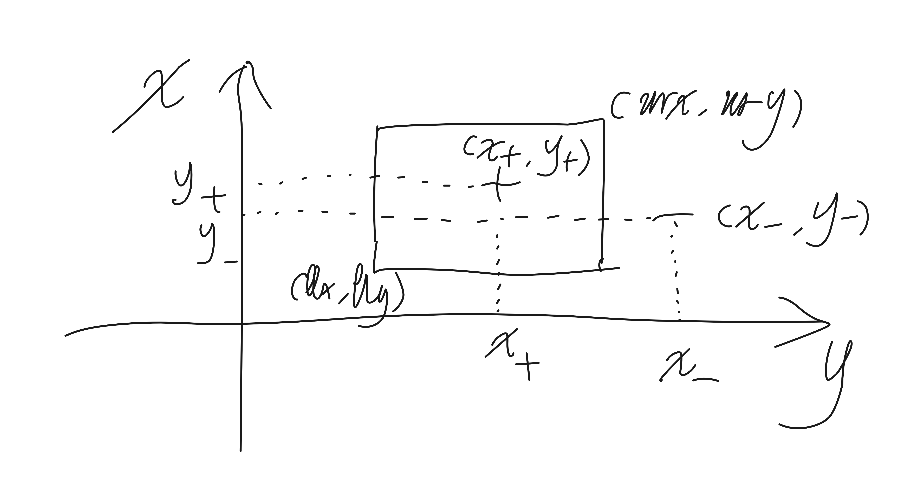

# 4.12 

推导出学习 x, y 平面上的矩形这一目标概念的梯度下降算法。使用 x, y 的坐标描述每一个假设，矩形的左下角和右上角分别表示为 llx, lly, urx 和 ury。实例<x, y>被假设<llx, lly, urx, ury>标记为正例的充要条件是点<x, y>位于对应的矩形内部。按本章中的办法定义误差E。试设计一个梯度下降算法来学习这样的矩形假设。注意误差E不是llx、lly、urx 和 ury 的连续函数，这与感知器学习的情况一样（提示：考虑感知器中使用的两个解决办法：（1）改变分类法则来使用输出预测成为输入的连续函数；（2）另外定义一个误差——比如到矩形中心的距离——就像训练感知器的delta法则）。当正例和反例可被矩形分割时，设计的算法会收敛到最小误差假设吗？何时不会？该算法有局部极小值的问题吗？该算法与学习特征约束合取的符号方法相比如何？

---

