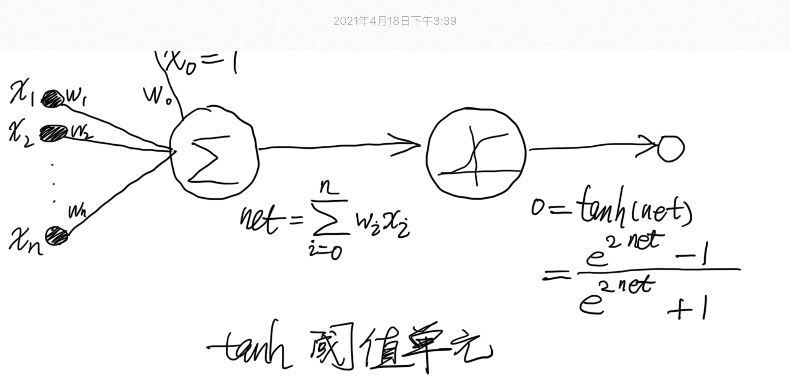

# 4.8

修改表 4-2 中的反向传播算法，使用双曲正切 tanh 函数取代 sigmoid 函数作为挤压函数。也就是说，假定单个单元的输出是 $| o = tanh(\vec{w} \cdot \vec{x})|$。给出输出层权值和隐藏层权值的权更新法则。提示：$|tanh'(x) = 1 - tanh^2(x)|$。

---

### 修改后的表 4-2：包含两层双曲正切单元的前馈网络的反向传播算法（随机梯度下降版本）

BACKPROPAGATION(training_examples, $|\eta, n_{in}, n_{out}, n_{hidden}|$)
> training_examples 中每一个训练样例是形式为 $| <\vec{x}, \vec{t}> |$ 的序偶，其中 $| \vec{x} |$ 是网络输入值向量，$|\vec{t}|$ 是目标输出值。

> $|\eta|$ 是学习速率（例如 0.05）。$|n_{in}|$ 是网络输入的数量，$|n_{hidden}|$ 是隐藏层单元数，$|n_{out}|$ 是输出单元数。

> 从单元 i 到单元 j 的输入表示为 $|x_{ji}|$，单元 i 到单元 j 的权值表示为 $|w_{ji}|$。

- 创建具有 $|n_{in}|$ 个输入，$|n_{hidden}|$ 个隐藏单元，$|n_{out}|$ 个输出单元的网络
- 初始化所有的网络权值为小的随机值（例如 -0.05 和 0.05 之间的数）
- 在遇到终止条件前：
  - 对于训练样例 training_examples 中的每个 $|<\vec{x}, \vec{t}>|$:

    把输入沿网络前向传播

    1\. 把实例 $$\vec{x}$$ 输入网络，并计算网络中每个单元 u 的输出 $$o_u$$

    使误差沿网络反向传播

    2\. 对于网络中的每个输出单元 k，计算它的误差项 $$\delta_k$$
    $$
    \delta_k \leftarrow (1-o^2_k)(t_k - o_k) \tag{4.14}
    $$

    3\. 对于网络中的每个隐藏单元 h，计算它的误差项 $$\delta_h$$
    $$
    \delta_h \leftarrow (1-o^2_h) \sum_{k \in outputs} w_{kh} \delta_k \tag{4.15}
    $$

    4\. 更新每个网络权值 $$w_{ji}$$
    $$
    w{ji} \leftarrow w_{ji} + \Delta w_{ji}
    $$

    其中

    $$
      \Delta w_{ji} = \eta \delta{j} x_{ji} \tag{4.16}
    $$

其中对于误差项的计算如下：

## 反向传播法则的推导

这里给出反向传播算法的权值调整法则的推导。

我们要解决的问题是推导出上表算法使用的随机梯度下降法则。根据公式（11）：
$$
E_d(\vec{w}) = \frac{1}{2} (t_d - o_d)^2 \tag{11}
$$
，随机的梯度下降算法迭代处理训练样例，每次处理一个。对于每个训练样例 d，利用关于这个样例的误差$$E_d$$的梯度修改权值。换句话说，对于每一个训练样例d，每个权$$w_{ji}$$被增加$$\Delta w_ji$$：

$$
\Delta w_{ji} = -\eta\frac{\partial E_d}{\partial w_{ji}}  \tag{12}
$$

其中，$$E_d$$是训练样例d的误差，通过对网络中所有输出单元的求和得到：
$$
E_d({\vec{w}}) \equiv \frac{1}{2} \sum_{k \in outputs}(t_k - o_k)^2
$$

这里，outputs 是网络中输出单元的集合，$$t_k$$是单元k对于训练样例d的目标值，$$o_k$$是给定训练样例d时单元k的输出值。

随机梯度下降法则的推导在概念上是易懂的，但需要留意很多下标和变量。我们将遵循下图中所画出的符号，增加一个下标 j 用来表示网络中第 j 个单元。

具体如下：

- $$x_{ji} = 单元 j 的第 i 个输入$$
- $$w_{ji} = 与单元 j 的第 i 个输入相关联的权值$$
- $$net_j = \sum_i w_{ji} x_{ji} （单元 j 的输入的加权和）$$
- $$o_j = 单元 j 计算出的输出 $$
- $$t_j = 单元 j 的目标输出 $$
- $$\tanh = 双曲正切函数 $$
- $$outputs = 网络最后一层的单元的集合$$
- $$Downstream(j) = 单元的直接输入（immediate \thickspace inputs）中包含的单元 j 的输出的单元的集合$$

现在我们导出$$\frac{\partial E_d}{\partial w_{ji}}$$ 的一个表达式，以便实现公式（12）中所讲的随机梯度下降法则。首先，注意权值$$w_{ji}$$仅能通过$$net_j$$影响网络的其他部分。所以，我们可以使用链式规则得到：

$$
\frac{\partial E_d}{\partial w_{ji}} = \frac{\partial E_d}{\partial net_j} \frac{\partial net_j}{\partial w_{ji}}
$$

$$
= \frac{\partial E_d}{\partial net_j} x_{ji} \tag{13}
$$

已知等式（13），我们剩下的任务就是为$$\frac{\partial E_d}{\partial net_j}$$导出一个方便的表达式。我们依次考虑两种情况：一种情况是单元 j 是网络中的一个输出单元，另一种情况是 j 是一个内部单元。

### 情况 1：输出单元的权值训练法则

就像$$w_{ji}$$仅能通过$$net_j$$影响网络一样，$$net_j$$仅能通过$$o_j$$影响网络。所以我们可以再次使用链式规则得出：
$$
\frac{\partial E_d}{\partial net_j} = \frac{\partial E_d}{\partial o_j} \frac {\partial o_j}{\partial net_j} \tag{14}
$$

首先，仅考虑上式（14）中的第一项： 
$$
\frac{\partial E_d}{\partial o_j} = \frac{\partial}{\partial o_j} \frac{1}{2} \sum_{k \in outputs} (t_k - o_k)^2
$$

除了当k=j时，所有输出单元k的导数$$\frac{\partial}{\partial o_j}(t_k - o_k)^2$$为0.所以我们不必对多个输出单元求和，只需要设k = j。

$$
\frac{\partial E_d}{\partial o_j} = \frac{\partial }{\partial o_j}\frac{1}{2}(t_j - o_j)^2
$$

$$
=\frac{1}{2} 2 (t_j - o_j) \frac{\partial (t_j - o_j)}{\partial o_j}
$$

$$
=-(t_j-o_j) \tag{15}
$$

接下来考虑公式（14）中的第二项。既然$$o_j = \tanh(net_j)$$，导数 $$\frac{\partial o_j}{\partial net_j}$$ 就是$$\tanh$$ 函数的导数，由提示可知：$$\tanh'(net_j) = 1 - \tanh^2(net_j)$$。所以：

$$
\frac{\partial o_j}{\partial net_j} = \frac{\partial \tanh(net_j)}{\partial net_j}
$$

$$
= 1 - o^2_j \tag{16}
$$

把表达式（15）和（16）代入（14），我们得到：
$$
\frac{\partial E_d}{\partial net_j} = -(t_j - o_j)(1- o^2_j) \tag{17}
$$

然后与公式（12）和（13）合并，我们便推导出了输出单元的随机梯度下降法则： 
$$
\Delta w_{ji} = -\eta \frac{\partial E_d}{\partial w_{ji}} = \eta (t_j - o_j)(1-o^2_j)x_{ji} \tag{18}
$$

注意，这个训练法则恰恰是修改后的表4-2算法中的公式（4.14）和公式（4.16）的权值更新法则。此外，我们可以发现公式（4.14）中的$$\delta_k$$与$$-\frac{\partial E_d}{\partial net_k}$$ 的值相等，所以可以使用 $$\delta_i$$ 来表示任意单元i的$$-\frac{\partial E_d}{\partial net_j}$$。

### 情况 2：隐藏单元的权值训练法则

对于网络中的内部单元或者说隐藏单元的情况，推导$$w_{ji}$$必须考虑$$w_{ji}$$间接地影响网络输出，从而影响$$E_d$$。由于这个原因，我们发现定义网络中单元j地所有直接下游单元的集合（也就是直接输入中包含单元 j 的输出的所有单元）是有用的。我们用 Downstream(j) 表示这样的单元集合。注意，$$net_j$$只能通过Downstream(j)中的单元影响网络输出（再影响$$E_d$$）。所以可以得出如下推导：

$$
\frac{\partial E_d}{\partial net_j} = \sum_{k \in Downstream(j)} \frac{\partial E_d}{\partial net_k} \frac{\partial net_k}{\partial net_j}
$$

$$
= \sum_{k \in Downstream(j)} - \delta_k \frac{\partial net_k}{\partial net_j}
$$

$$
= \sum_{k \in Downstream(j)} - \delta_k \frac{\partial net_k}{\partial o_j} \frac{\partial o_j}{\partial net_j}
$$

$$
= \sum_{k \in Downstream(j)} - \delta_k w_{kj} \frac{\partial o_j}{\partial net_j}
$$

$$
= \sum_{k \in Downstream(j)} - \delta_k w_{kj} (1-o^2_j)
$$

重新组织各项并使用$$\delta_j$$表示$$-\frac{\partial E_d}{\partial net_j}$$，我们得到： 

$$
\delta_j = (1-o^2_j) \sum_{k \in Downstream(j)}\delta_k w_{kj}
$$

和

$$
\Delta w_{ji} = \eta \delta_j x_{ji}
$$

上式就是由公式（4.19）得到的一般法则，用来更新任意有向无环网络结构内部单元的权值。

$$
\delta_r = (1-o^2_r) \sum_{s \in Downstream(r)} w_{sr} \delta_s \tag{4.19}
$$

注意，修改后表4-2中的公式（4.15）仅是这个法则当Downstream(j) = outputs时的一个特例。

